# Documentation of Project-1
STEP 1 — INSTALLING APACHE AND UPDATING THE FIREWALL

- The command below updates a list of packages in package manager

`sudo apt update`

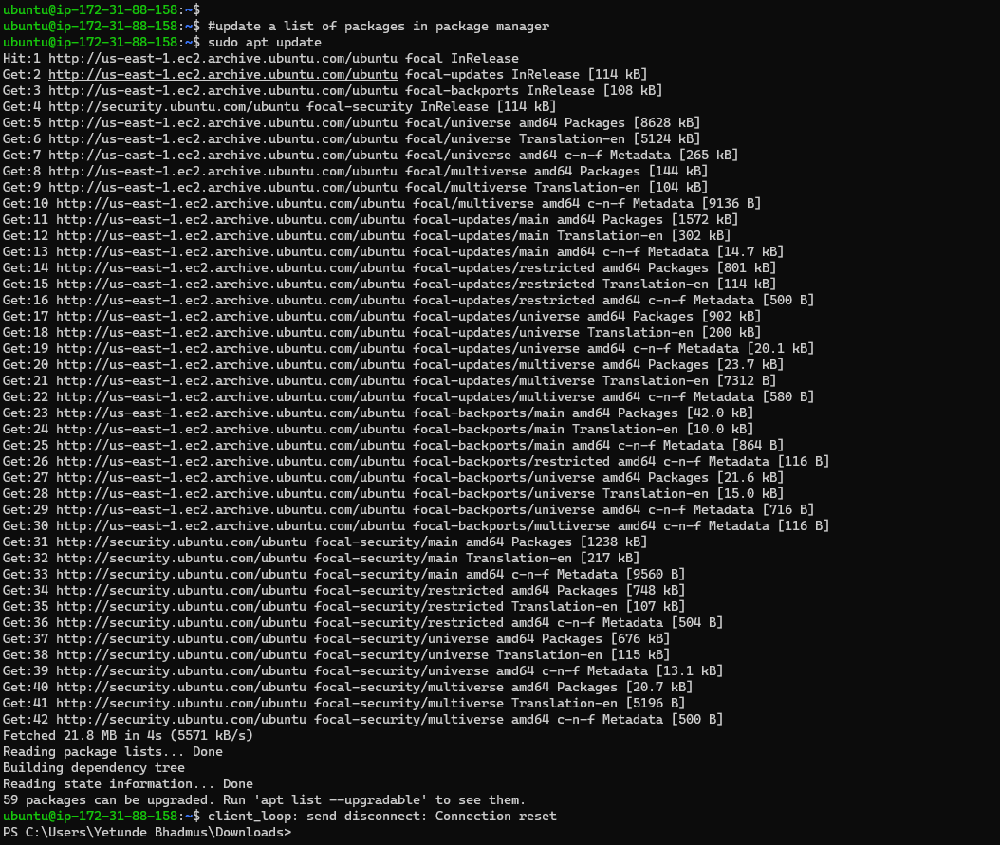

- The command below runs apache2 package installation

`sudo apt install apache2`

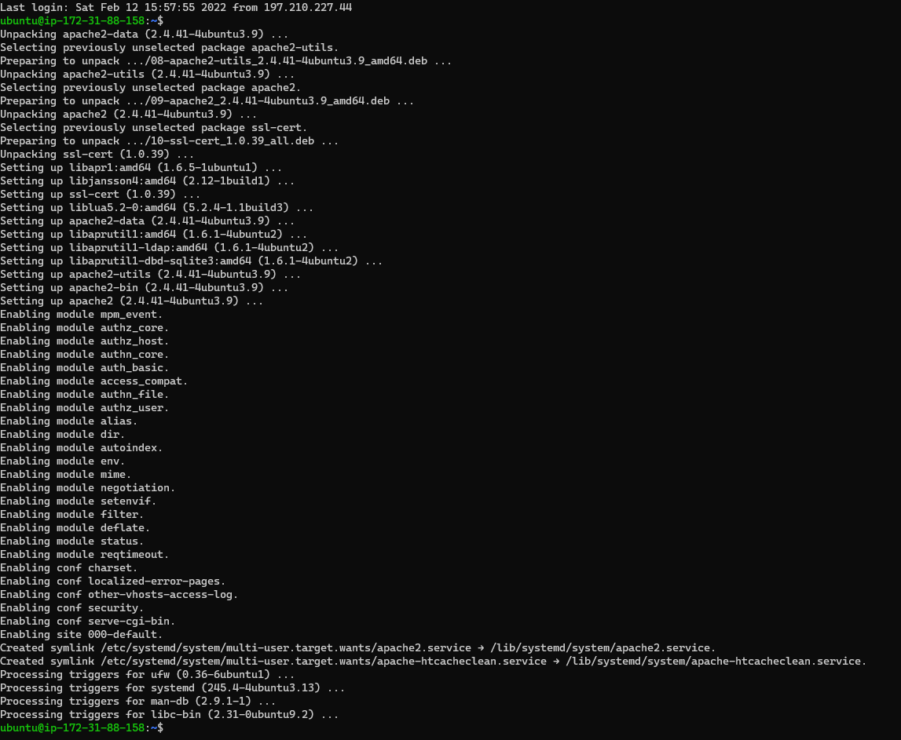
- The command below verifies that apache2 is running as a Service in our OS

`sudo systemctl status apache2`

- See output below

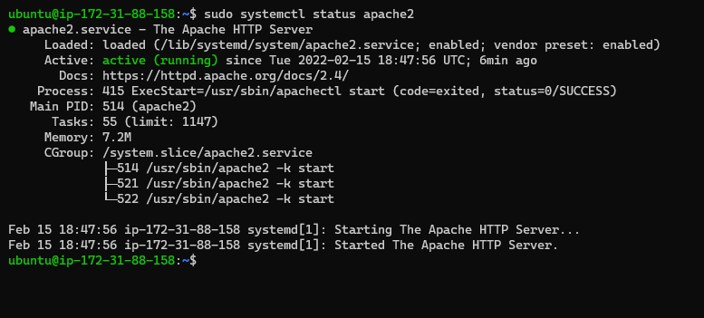

- Opened TCP port 80 in the EC2 Instance

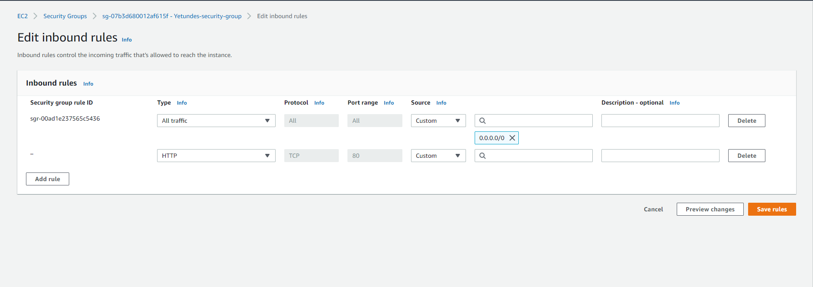

- The below command  check if Apache can be accessed locally

`curl http://localhost:80`

- Output to check if we can access the apache2 locally

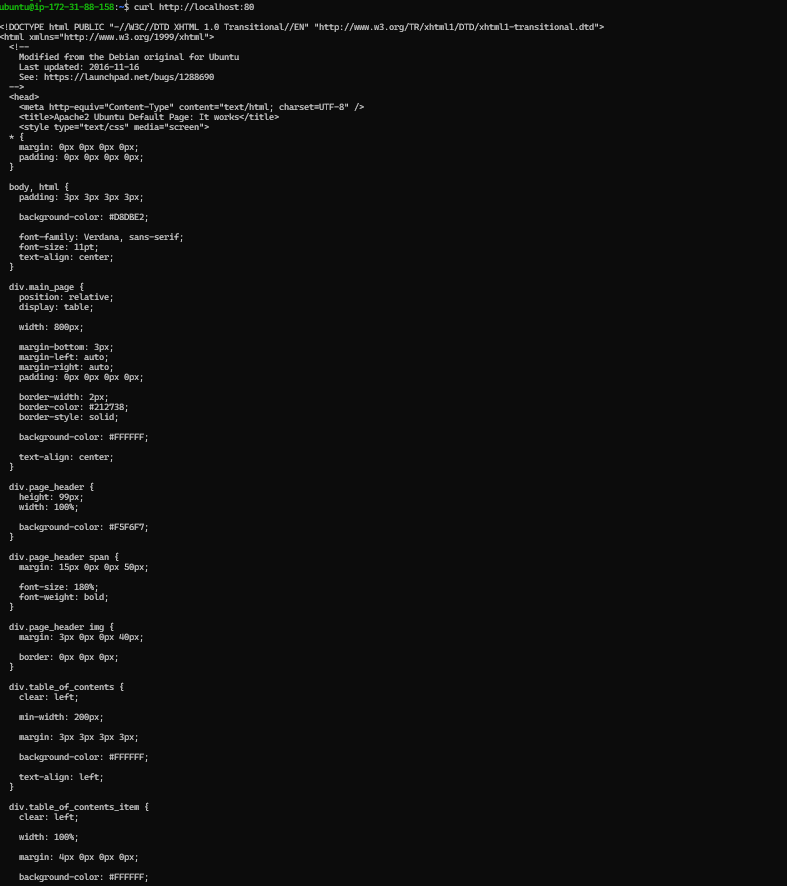

- Test verify that apache server is running over the browser

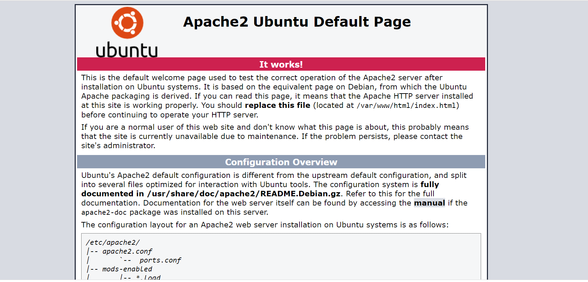

STEP 2 — INSTALLING MYSQL

- The command below runs mysql-server installation

`sudo apt install mysql-server`

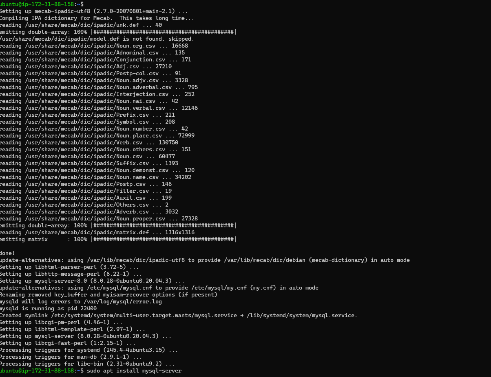

- The command below runs mysql-secure installation

`sudo mysql_secure_installation`

- Ouput of the secure installation

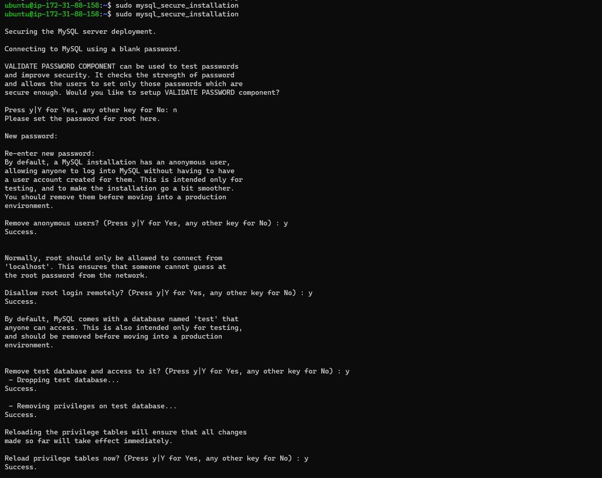

- This code verifies that we can log in to the MySQL server

`sudo mysql`

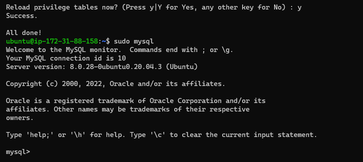

STEP 3 — INSTALLING PHP

- The command below runs php installation

`sudo apt install php libapache2-mod-php php-mysql`

Ouput of the php installation

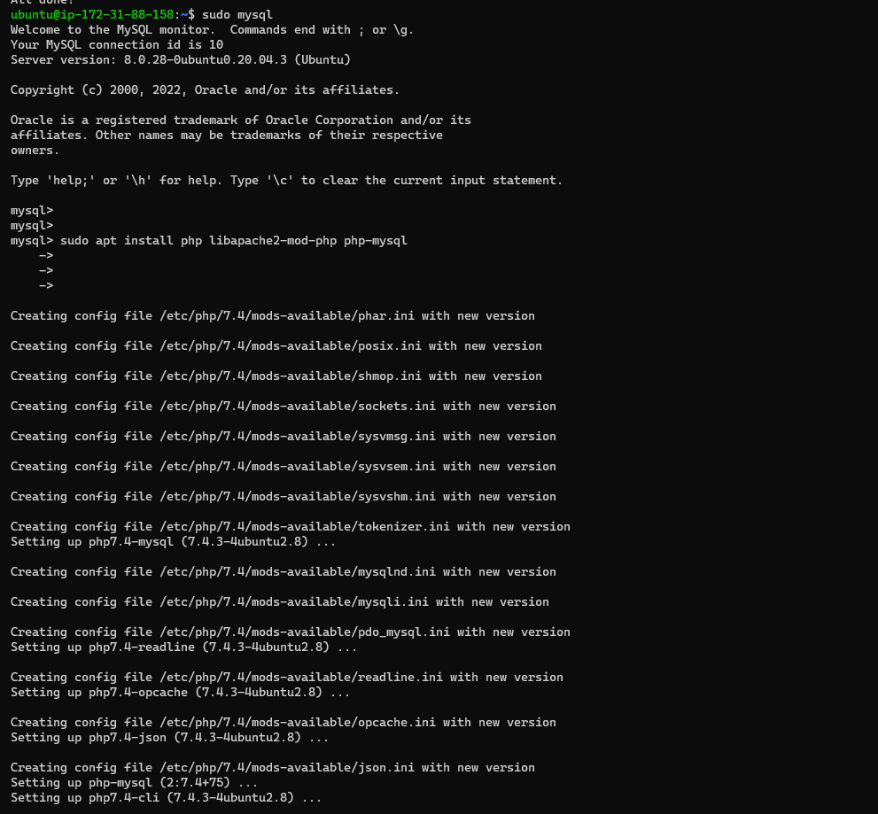

- The command below confirms php version

`php -v`

Ouput of the php version

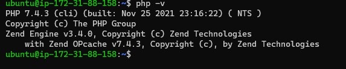

STEP 4 — CREATING A VIRTUAL HOST FOR YOUR WEBSITE USING APACHE

- A directory for projectlamp was created using the command below

`sudo mkdir /var/www/projectlamp`

- Ownership was assigned to the directory with this variable $USER which still referenced the system user, Code below

`sudo chown -R $USER:$USER /var/www/projectlamp`

- Created and opened a new configuration file in Apache’s sites-available directory using "vi" command-line editor

`sudo vi /etc/apache2/sites-available/projectlamp.conf`

- Pasted the below

<VirtualHost *:80>
    ServerName projectlamp
    ServerAlias www.projectlamp 
    ServerAdmin webmaster@localhost
    DocumentRoot /var/www/projectlamp
    ErrorLog ${APACHE_LOG_DIR}/error.log
    CustomLog ${APACHE_LOG_DIR}/access.log combined
</VirtualHost>

- Saved and closed the file by following the steps below:
Hit the esc button on the keyboard
Type :
Type wq. w for write and q for quit
Hit ENTER to save the file

- The command below shows the new file created in the sites-available directory

`sudo ls /etc/apache2/sites-available`

 - Output Below

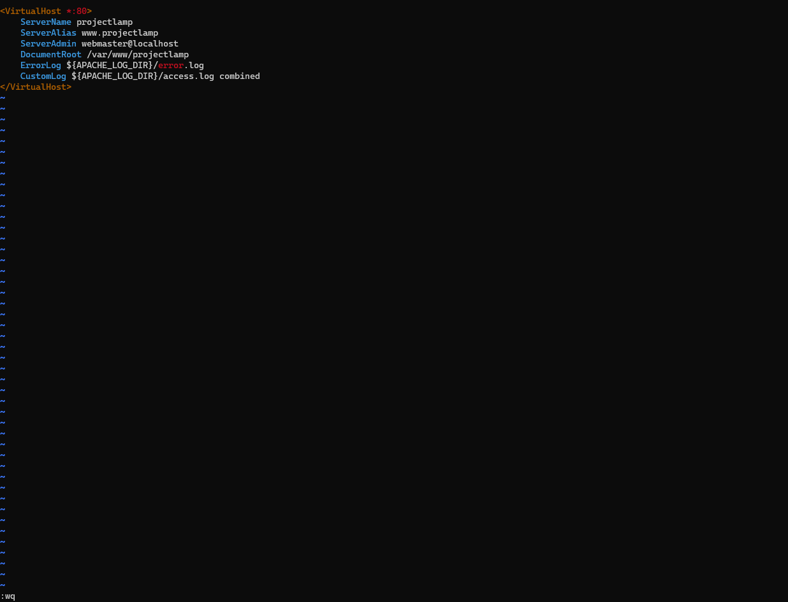

- The new virtualhost enabled with the below command    

`sudo a2ensite projectlamp`

- The default website that comes installed with Apache was disabled with the below command

`sudo dissite 000-default`

- To make sure configuration file doesn’t contain syntax errors, below command was ran

`sudo apache2ctl configtest`

- Apache Reloaded with the command below

to edit the /etc/apache2/mods-enabled/dir.conf file and change the order in which the index.php file is listed within the DirectoryIndex directive:

- See Output of the above commands below

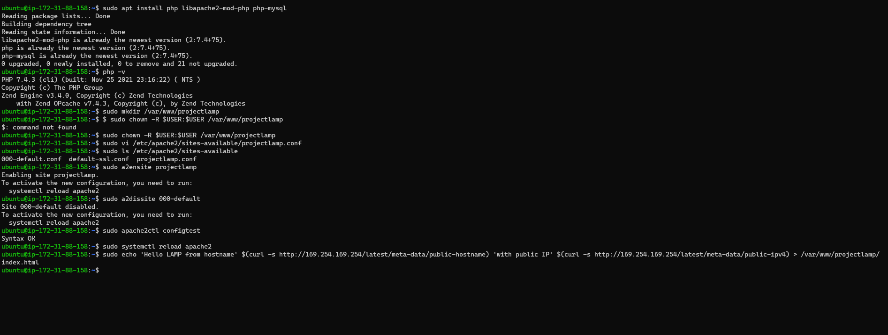

- Index.html file was created in the /var/www/projectlamp location to test if the virtual host works fine with the command below

`sudo echo 'Hello LAMP from hostname' $(curl -s http://169.254.169.254/latest/meta-data/public-hostname) 'with public IP' $(curl -s http://169.254.169.254/latest/meta-data/public-ipv4) > /var/www/projectlamp/index.html`

- Output Below

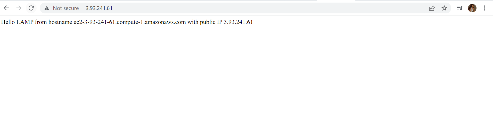

STEP 5 — ENABLE PHP ON THE WEBSITE

- To edit the /etc/apache2/mods-enabled/dir.conf file and change the order in which the index.php file is listed within the DirectoryIndex directive, the command below was use used

`sudo vim /etc/apache2/mods-enabled/dir.conf`
  
- The command as showm in the screenshot was used

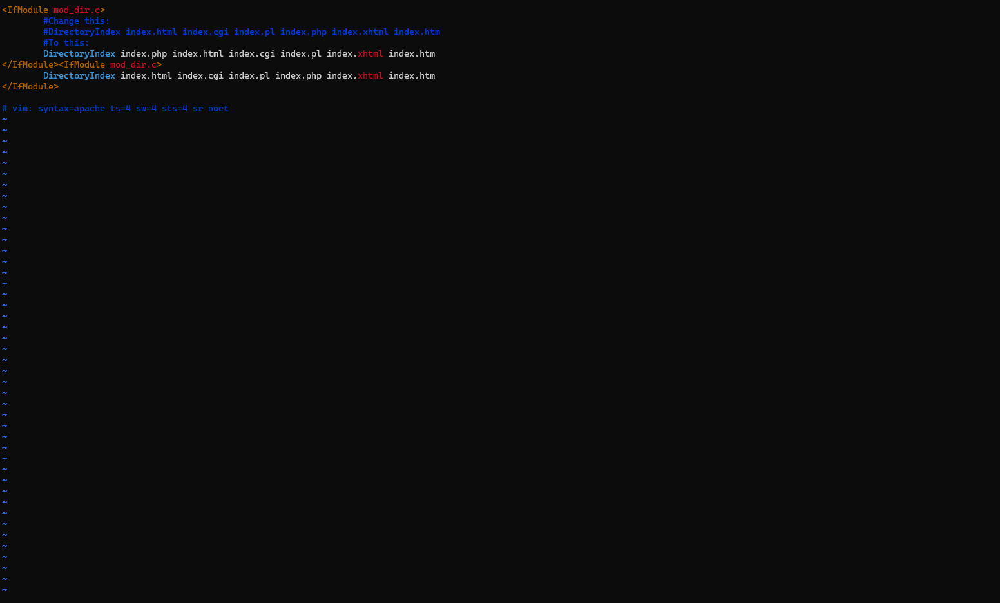

- After saving and closing the file, Apache was reloaded so the changes could take effect, the command below was used

`sudo systemctl reload apache2`

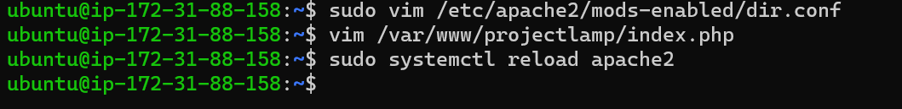

- Create a new file named index.php inside your custom web root folder

`vim /var/www/projectlamp/index.php`

- The php code as shown in the screenshot was added to the newly created file

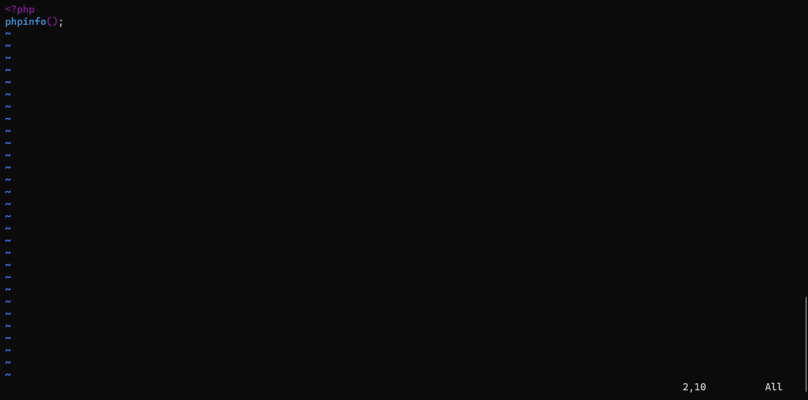

- Below was the output on the web browser after it was refreshed

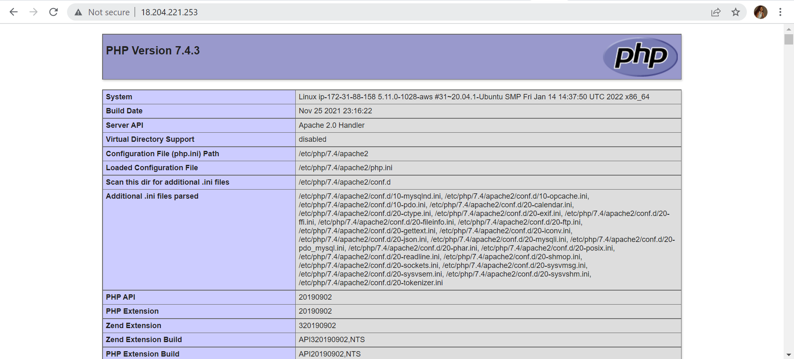

